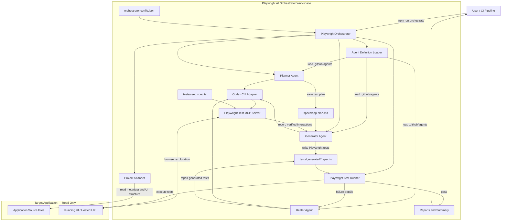

# Architecture

## Overview

The Playwright AI Orchestrator creates and maintains end-to-end tests for an already-running web application. The target application source is read-only; all plans, generated tests, reports, and agent definitions remain in the orchestrator workspace.

## Execution flow

1. The orchestrator loads `orchestrator.config.json` and validates the target folder, agent definitions, seed test, and output paths.
2. The project scanner reads the target application structure without modifying it.
3. The planner uses the seed and Playwright MCP browser tools to explore the live application and writes `specs/app-plan.md`.
4. The generator executes every planned scenario against the live UI and writes verified Playwright tests under `tests/generated`.
5. Playwright runs only the generated-test folder.
6. When tests fail, the healer debugs and updates generated tests, then the orchestrator reruns them up to `maxHealAttempts`.
7. The final status is written to `reports/orchestrator-summary.json`.

## Core design decisions

- **Target isolation:** `projectFolder` is read-only application context, not a location for Playwright artifacts.
- **Live verification:** tests are based primarily on real browser interactions rather than source-code guesses.
- **Agent source of truth:** planner, generator, and healer instructions come from `.github/agents`.
- **Portable outputs:** generated plans, tests, reports, and logs stay in the orchestrator workspace.
- **Replaceable target:** another application can be tested by changing `projectFolder`, `appUrl`, and the seed setup.

## Main deliverables

| Deliverable | Purpose |
| --- | --- |
| `specs/app-plan.md` | Generated functional test plan. |
| `tests/generated/*.spec.ts` | Generated Playwright tests. |
| `reports/orchestrator-summary.json` | Workflow status and failure summary. |
| `playwright-report/` | Playwright HTML execution report when enabled. |
| `logs/*.log` | Setup and export activity logs. |
